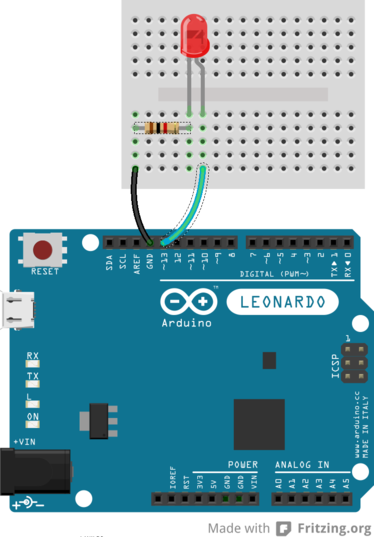

#01—Blink

__Introduction:__  
The purpose of this exercise is to setup the Arduino IDE and write a
simple program that blinks an LED on the Arduino

##Step 1: Install and setup the Arduino IDE

1. If the Arduino IDE is not already installed, go to http://arduino.cc/
and follow the instructions on the website to install it. 

2. Launch the Arduino IDE. It should bring up a window with an empty sketch.

3. Configure the Arduino ID for use the Arduino Leonardo by going to Tools->Board->Arduino Leonardo.

4. Plug a Micro USB cable into the Arduino's USB port. Be gentle when plugging it in so that you don't break it. The cable only goes in part way. Plug the other side of the USB cable into the computer. The green and orange lights on the Arduino should turn on.

5. Now that the Arduino is plugged in, it should be possible to tell the Arduino IDE where to find it. The Arduino talks to the Arduino IDE through something called a serial port. Serial ports have names. Go to the Tools->Serial Port menu and check that one of the serial ports has a check mark next to it. If it does not and there is only one choice, select that choice. If there is more than one choice, ask for help.

Good work! You are now ready to start writing programs for the Arduino.

##Step 2: Blink

1. We're going to write a program that blinks the LED next to the letters L13 on the board. The LED might be on already. It is bright orange. If it is not on, don't worry. Find the LED and go to the next step.

2. The LED is connected to Pin 13. On the Arduino, the function digitalWrite lets you change Pin 13 to be high or low. When you connect an LED to Pin 13, this can be used to turn the LED on and off. Enter the following code into the editor:  

    ```c
    void setup() {
        pinMode(13, OUTPUT);
    }

    void loop() {
        digitalWrite(13, HIGH);
        delay(1000);
        digitalWrite(13, LOW);
        delay(1000);
    }
    ```

3. Double check you entered the code correctly. Go to File->Save and save the program.

4. Compile the sketch by clicking on the check mark circle or by going to Sketch->Verify/Compile. If there are errors, the bottom of the screen will say "Error compiling" and tell you what is wrong. Fix the errors and recompile. You can also type CTRL-R to compile.

5. Now click on the right arrow that is next to the check mark to upload your code to the Arduino. If it worked, look at the LED marked L13. Is it blinking?

6. Change the code to make it blink faster. The number passed to the delay function is the number of milliseconds that the Arduino should wait.

7. What happens when you make the LED blink really fast? Try making the delay 10 or less.

8. Change the code to make the LED blink in a pattern. For example, make the LED blink slow two times and then fast two times and then repeat.

##Step 2: More and bigger LEDs

Next, we're going to connect up LEDs to the Arduino so that we can experiment with bigger and different color LEDs.

1. Unplug the USB cable going to the Arduino from the computer. This removes the power going from the computer to the Arduino so that if we make a mistake wiring things up, we won't accidentally break the Arduino.

2. We are going to need a breadboard, an LED, a 1000 Ohm resister, a black wire and a red wire. The LED can be any color, so pick one that you like. The resister has color bands on it that tell you its value. A 1000 Ohm resister has bands brown, black, black, brown, and then either a gold or brown band. The color of the last band doesn't matter.

3. Connect the components up like in the following picture:




