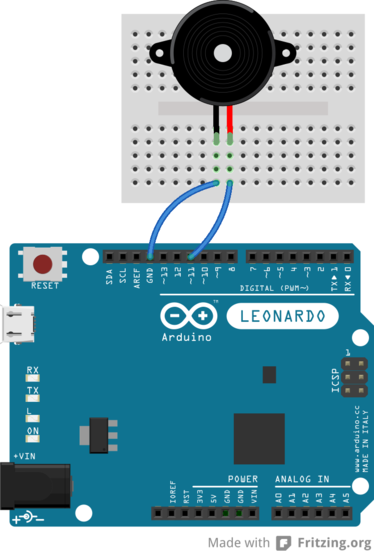

#02—Tones and Music

__Introduction:__
The purpose of this exercise is to learn how to make noise on the Arduino and then to write programs that play music.

##Step 1: Build the circuit and play a tone

1. If the Arduino is connected to a PC, disconnect it.

2. Find a Piezo buzzer. The ones that we have are black cylinders. If there is a sticker on the top of the buzzer, take it off. Find a black wire and a red wire.

3. Wire up the circuit like in the following picture. The wires under the Piezo buzzer can be hard to see, so make sure that the black and red wires are connected to the right columns on the breadboard.



4. Now connect the Arduino back to the PC using the USB cable.

5. Enter the following program:

    ```c
    void setup() {
      tone(11, 440);
      delay(250);
      noTone(11);
    } 

    void loop() {
    }
    ```

6. Save the program. Press the `upload` button and listen for a sound. If you hear something, then good job. It worked!

##Step 2: Making music

The following chart lists notes and their frequencies:

```
    C  262
    C# 277
    D  294
    D# 311
    E  330
    F  349
    F# 370
    G  392
    G# 415
    A  440
    A# 466
    B  494
    C  523
```

See if you can make the Arduino play a song using the notes above.

